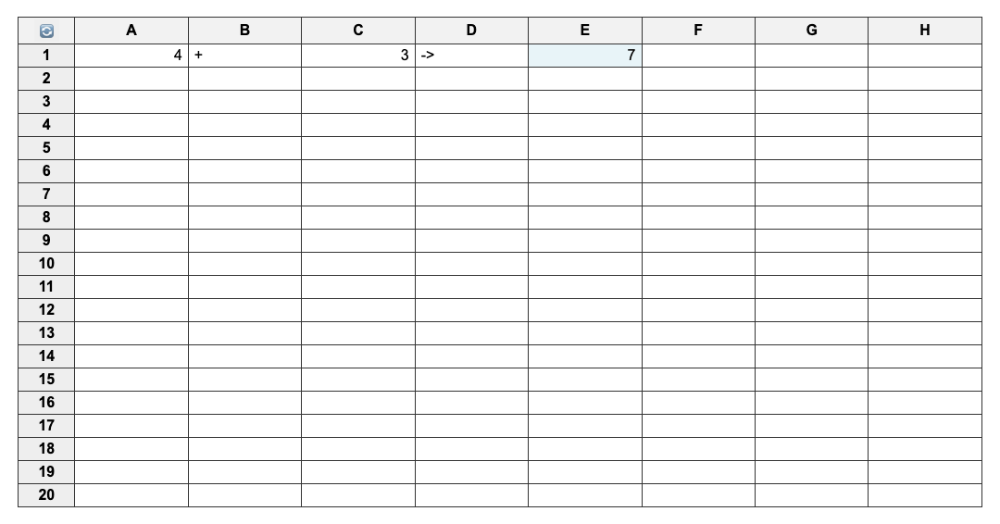

## Web Spreadsheet

An interactive web-based spreadsheet built with AngularJS. Supports basic editing, formula calculation (e.g., =A1+B2), and Excel-style keyboard navigation.

----
### Features
- Editable grid with cells labeled as A1, B2...
- Supports basic arithmetic formulas(+, -, *, /)
- Highlighted cells for calculated results
- Keyboard navigation with arrow keys and Enter
- Reset button to clear the spreadsheet

----
### Project Structure
```
my-web-spreadsheet/
├── index.html
├── css/
│   └── main.css
├── js/
│   └── app.js
```
----
### Usage

1. Open index.html in your browser.
2. Click on any cell to edit.
3. Use:
- =A1 + B2 to enter a formula
- Enter to move down
- Arrow keys to navigate
- Reset button (🔄) in top-left to clear all cells

----
### Preview 
<a href="https://peggiezx.github.io/my-web-spreadsheet/">Live Demo</a>


